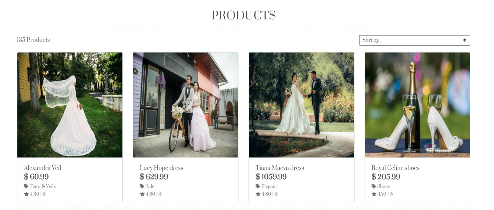

# ALANA wedding dress 
___

##  Full Stack Framework, Milestone 4
___

[Live Site](https://alana-app.herokuapp.com/)

Images here: 

___

###  Introduction

* Alana is a full-stack e-commerce web application for the future bride who wishes to buy a wedding dress, shoes, veil and tiara. 
This website offers more than 100 items in their store.

* This project is the 4th of my Milestone to get the full stack developer diploma at Code Institute. This project was made for educational purposes only. 

* This full-stack web application was built by using Django web framework, HTML, CSS, Javascript and Python.
* This website allows users to __Create__ an order, __Read__ order before checking out, __Update__  and __Delete__ item on their shopping cart. 
* Admin has the CRUD functionality to do add, update, delete products on the site.  

* Please note that this website is not real. To test shopping on the web please use this card number: 
   * Card number: 4242 4242 4242 4242
   * Expiration date: 04/24 
   * CVC: 242
   * You can use any name but use an e-mail you can receive the registration confirmation for creating a new account and your order details. 
   * Login information for the administrator/superuser will be provided when submitting this project.
 

# Table of Contents

1. [User Experience](#user-Experience)

   * [User Stories](#User-Stories)

   * [Strategy](#Strategy)

   * [Scope](#Scope)

   * [Structure](#Structure)
    
   * [Design](#Design)

   * [Project goals](#Project-goals)

 2. [Features](#Features)

 3. [Wireframe](#Wireframe)

 4. [Database](#Database)

 5. [Technology Used](#Technology-Used)

 6. [Testing](#Testing)

 7. [Bugs](#Bugs)

 8. [Deployment](#Deployment)

 9. [Credits](#Credits)

 ___

 ## User Experience

-  The main idea for the website is to sell:
   * Wedding dresses
   * Wedding Shoes
   * Veils
   * Tiara

 

 ### User Stories

- As a first time user, I want:
   * To quickly understand the purpose of the website.
   * To navigate through the site easily and clearly.
   * To find or search for items that are related to the wedding.
   * Contact support for help.
   * To do be able to shop without creating an account 
   * To be able to register an account if I want to.
   

  
- As a returning user, I want:
   * Navigate smoothly through the site again
   * To be able to sign in without a problem 
   * To be able to create a new password if I forgot it.
   * To find details about my previous order details.
   * To find information about me on my profile and update it.
   * Find a wedding dress or shoes with my sizes.
   * Search for product sorted by price, name, rating and category.
   

 - As admin and business site owner I want to:
   * Navigate on the site easily as all other users.
   * Add and delete items.
   * Manage Category
   * update products description and price.
   * Make sure that it is only me who can manage the products item.
   * Access orders details for the shopper.
   * Make sure that the user can contact me for help or other information. 

 ### Strategy

 - Project goals:
   * Create a website that uses HTML, CSS, Javascript, Python, Django.
   * Create a website that is easy to navigate and simple.
   * Create a fully responsive site that is compatible with all devices.
   * Creating a website that uses a relational database.
   * Creating a website that uses Stripe.

- Site owner goals:
   * Create a secure e-commerce web application.
   * Give the best experience to the user.

### Scope

- Planned features:
   * Responsive site and user-friendly on all devices.
     * This site should be responsive with bootstrap.

   * Navbar
     

     

     * The navbar is applied all over the pages.
     * The navbar changes the layout to different devices. The menu is collapsible on mobile devices.
     * The navbar contains a search bar, navbar menu, account and cart links.
     * The search bar menu looks different when it reduces on mobile devices.
     * Navbar menu: 

     

   * Langing page
      * In the middle of the page there is information about the new collection and a shopw now button that links to all the products items. 

     

   * Products page

     * All the items with different categories are shwon in the product page.
     * Shopper can use the sorting button to sort product by price, rating, name and category.

     

  * Product detail
    * This page provides a clearly detail information to the user about the products.
    * The name of the product.
    * The rating, price, size if the product has size. 
    * The quantity.
    * Keep shopping and add to cart buttons.

    

  * Shopping Cart
    * When the shopping cart is empty , it showing a big cart icon and a text.

    

    * When there is item in the shopping cart, it is showing details about your item.
    * The total amount, the delivery information, the price, quantity, subtotal.
    * User have a possibility to remove and update the shopping cart.

    
  

   * Profile
    * User delivery information is show here in the profile page.
    * Address, City, State, Phone number , postal code and country. 
    * User can also update the user profile here. 

    

   * Contact Page
    * The contact page is simple and easy to use.
    * User can find the site phone number, support hours, e-mail and social link here. 

    

   * Checkout page
      * Here can user with an account add delivery information.
      * User with account, theri information is filled automatically exceot their name.
      * Order summary and payement details are shown here.

      

   * Product Management
   * Sign In
   * Sign Up

   

 ### Structure

 ### Design

 ### Project goals

 ___

 ## Features

 ___

 ## Wireframe

 ___

 ## Database

 ___

 ## Technology Used

 ___

 ## Testing

 ___

 ## Bugs

 ___

 ## Deployement 

 ___

 ## Credits

 ___

