# ALANA wedding dress 
___

##  Full Stack Framework, Milestone 4
___

[Live Site](https://alana-app.herokuapp.com/)


___

###  Introduction

* Alana is a full-stack e-commerce web application for the future bride who wishes to buy a wedding dress, shoes, veil and tiara. 
This website offers more than 100 items in their store.

* This project is the 4th of my Milestone to get the full stack developer diploma at Code Institute. This project was made for educational purposes only. 

* This full-stack web application was built by using Django web framework, HTML, CSS, Javascript and Python.
* This website allows users to __Create__ an order, __Read__ order before checking out, __Update__  and __Delete__ item on their shopping cart. 
* Admin has the CRUD functionality to do add, update, delete products on the site.  

* Please note that this website is not real. To test shopping on the web please use this card number: 
   * Card number: 4242 4242 4242 4242
   * Expiration date: 04/24 
   * CVC: 242
   * You can use any name but use an e-mail you can receive the registration confirmation for creating a new account and your order details. 
   * Login information for the administrator/superuser will be provided when submitting this project.
 

# Table of Contents

1. [User Experience](#user-Experience)

   * [User Stories](#User-Stories)

   * [Strategy](#Strategy)

   * [Features](#Features)

   * [Structure](#Structure)
    
   * [Design](#Design)

 2. [Wireframe](#Wireframe)

 3. [Database](#Database)

 5. [Technology Used](#Technology-Used)

 6. [Testing](#Testing)

 7. [Bugs](#Bugs)

 8. [Deployment](#Deployment)

 9. [Credits](#Credits)

 ___

 ## User Experience

-  The main idea for the website is to sell:
   * Wedding dresses
   * Wedding Shoes
   * Veils
   * Tiara

 [Back to Table of contents](#Table-of-Contents)

 ### User Stories

- As a first time user, I want:
   * To quickly understand the purpose of the website.
   * To navigate through the site easily and clearly.
   * To find or search for items that are related to the wedding.
   * To be able to rate a review about a product. 
   * Contact support for help.
   * To do be able to shop without creating an account 
   * To be able to register an account if I want to.
   

  
- As a returning user, I want:
   * Navigate smoothly through the site again
   * To be able to sign in without a problem 
   * To be able to create a new password if I forgot it.
   * To find details about my previous order details.
   * To find information about me on my profile and update it.
   * Find a wedding dress or shoes with my sizes.
   * Search for product sorted by price, name, rating and category.
   

 - As admin and business site owner I want to:
   * Navigate on the site easily as all other users.
   * Add and delete items.
   * Manage Category
   * update products description and price.
   * Make sure that it is only me who can manage the products item.
   * Access orders details for the shopper.
   * Make sure that the user can contact me for help or other information. 

[Back to Table of contents](#Table-of-Contents)

 ### Strategy

 - Project goals:
   * Create a website that uses HTML, CSS, Javascript, Python, Django.
   * Create a website that is easy to navigate and simple.
   * Create a fully responsive site that is compatible with all devices.
   * Creating a website that uses a relational database.
   * Creating a website that uses Stripe.

- Site owner goals:
   * Create a secure e-commerce web application.
   * Give the best experience to the user.


[Back to Table of contents](#Table-of-Contents)

### Features

- Planned features:
   * Responsive site and user-friendly on all devices.
     * This site should be responsive with bootstrap.


   * Navbar
     

     

     * The navbar is applied all over the pages.
     * The navbar changes the layout to different devices. The menu is collapsible on mobile devices.
     * The navbar contains a search bar, navbar menu, account and cart links.
     * The search bar menu looks different when it reduces on mobile devices.
     * Navbar menu: 

     


   * Landing page
      * In the middle of the page there is information about the new collection and a shopw now button that links to all the products items. 

     


   * Products page

     * All the items with different categories are shwon in the product page.
     * Shopper can use the sorting button to sort product by price, rating, name and category.


     


  * Product detail
    * This page provides a clearly detail information to the user about the products.
    * The name of the product.
    * The rating, price, size if the product has size. 
    * The quantity.
    * Keep shopping and add to cart buttons.


    


  * Shopping Cart
    * When the shopping cart is empty , it showing a big cart icon and a text.

    


    * When there is item in the shopping cart, it is showing details about your item.
    * The total amount, the delivery information, the price, quantity, subtotal.
    * User have a possibility to remove and update the shopping cart.


    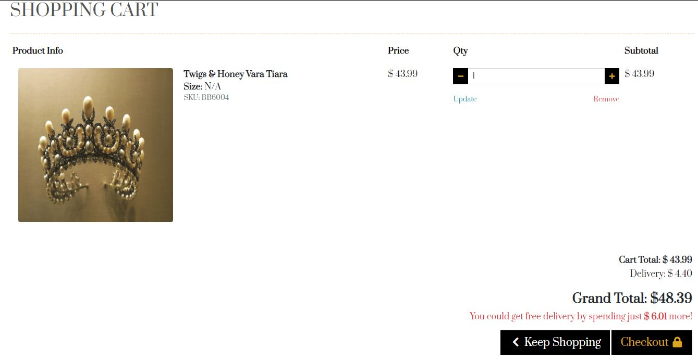
  

   * Profile
     * User delivery information is show here in the profile page.
     * Address, City, State, Phone number , postal code and country. 
     * User can also update the user profile here. 

    


   * Contact Page
     * The contact page is simple and easy to use.
     * User can find the site phone number, support hours, e-mail and social link here. 


    


   * Checkout page
      * Here can user with an account add delivery information.
      * User with account, theri information is filled automatically exceot their name.
      * Order summary and payement details are shown here.

      


   * Product Management
    * Admin can add product here directly from the site.

     
     


   * Login In
     * The login page is simple and easy to use. 


     


   * Sign Up
     * The sign up page contains 5 fields to fill to create an account.
    
     

  
  * 403,403,500 error
     * Error pages 403, 404 and 505 will be displayed if users by mistake click on a broken or dead link. 
     
     
     
     


  - Advanced feature

  1. Add pagination.
  1. Blog.
  1. User leave feedback and rating.
  1. Sign up to newsletters.
  1. Possibility to save Credit card number on the profile page.
    

[Back to Table of contents](#Table-of-Contents)

 ### Structure
     
  * Bootstraps were used on each page.   
  * A background image with a bride wearing a wedding dress will appear on the homepage which provides the user with clear information on what it is that I want them to buy.  
  * Use black and goldenrod colours as the base on the site
  * Buttons and links are created for the user to move from page to page.
  * Toast message tells us every time we make changes like:
         * Update profile information.
         * Delete a product from the shopping cart.
         *  Update shopping cart.
         * An Error occurs.
         * Add product to the shopping cart.
  * Simple form for registration and login
  * Navbar menu tell user where to navigate, the same on each page.
  * 

[Back to Table of contents](#Table-of-Contents)

 ### Design
    
  * Surface
     * Colours:

       - I choose black, white and golderond to reflect the beauty of  the webiste. 

       - Text buttons and deivery banner har goldenrod with backgroun balck and grey.

       - [Palette](https://coolors.co/) of the colors that I used:

        
       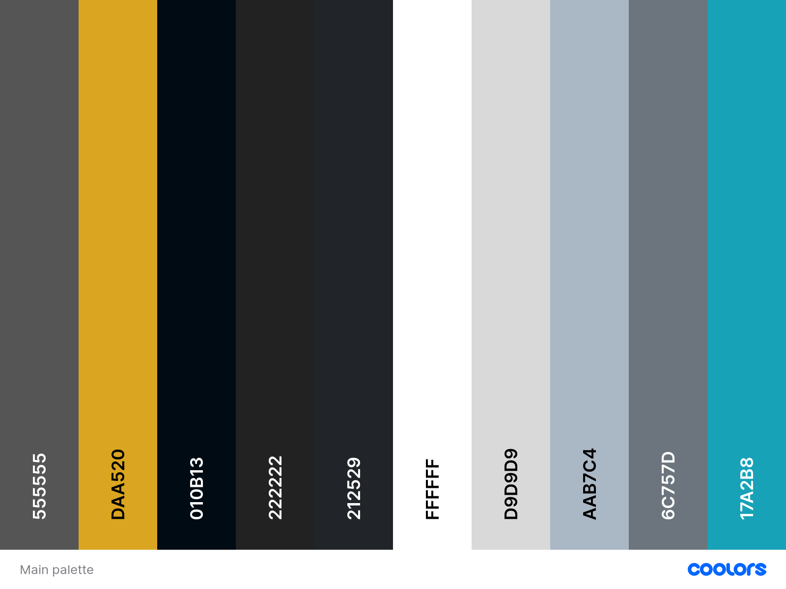


       - Bootstrap colors:


       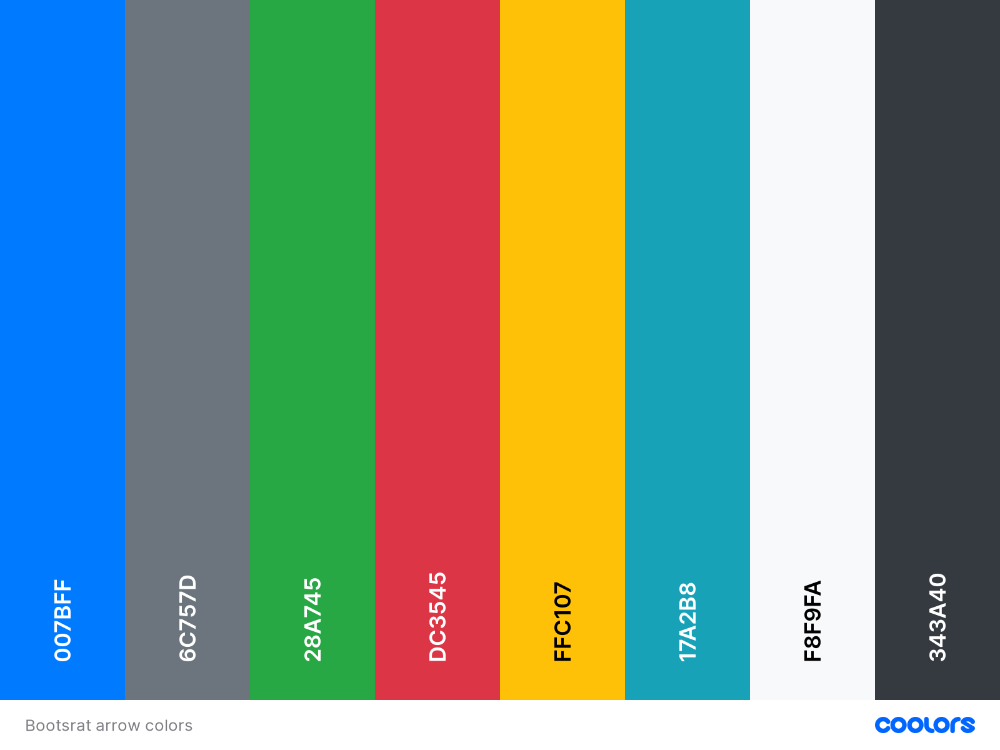

    
     * Typography :
       
       - KG I And Love And You Font used to styled the logo-font from [fontspace](https://www.fontspace.com/kg-i-and-love-and-you-font-f19145)

       - Sweetheart Font used to for the logo-font subtitle from [fontpace]( https://www.fontspace.com/sweetheart-2-font-f65879)

       - Prata used for the rest of the page from [Google font](https://fonts.google.com/specimen/Prata?query=prata)

     
     * Icons

       - In this project, icons are provided by [Fontawesome](https://fontawesome.com/).

     * Images

       - [Compressor](https://compressor.io/)  and [Simpleimageresizer](http://www.simpleimageresizer.com/) used to reduce the size of the images without loosing the original quality. 
       
       - The background image of the landing page and all the images on the products were taken for free from [pixabay](https://pixabay.com/sv/)

       - The product images was resize to 1000 x 1000. Images on this size can be zoomed. Tips from this [blog](https://www.jimdo.com/blog/optimize-website-images-for-better-design-seo/) .

       - All images has the same size and styles except the homepage background image.


      * Defensive design

        - More than 8 characters required for password by creating an account.

        - Shopper can not order more than 100 items at once

        - Credit card must be given when completing order.

        - Only admin can add and make changes on the site. 
 
 [Back to Table of contents](#Table-of-Contents)       
 ___

 ## Wireframe

  * [All wireframes](https://documentcloud.adobe.com/link/review?uri=urn:aaid:scds:US:2882963a-86d9-4e4f-a701-e195e4ae9503) are availabe here. 


[Back to Table of contents](#Table-of-Contents)

 ___


 ## Database

  * Sqlite3 used during development in gitpod

  * Postgres used after deploying to Heroku


  * Models and custom model, created from [dbdiagram](https://dbdiagram.io/) 


  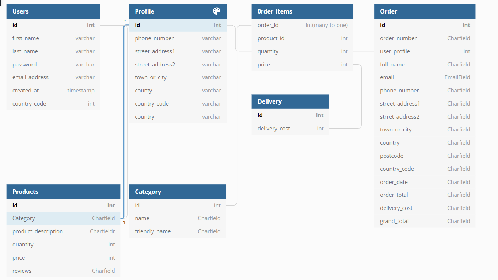

 
  #### Profile App
  
  * User profile model

  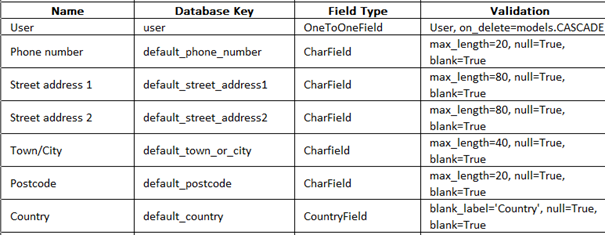


  #### Checkout App

  * Order model

  


  #### Product App

  * Product model

  


  * Product Review model

  


 [Back to Table of contents](#Table-of-Contents)

 ___

 ## Technology Used
    
  * Languages Used

    
     * HTML5 : for structure and the content for my project.
 
     * CSS : provides the style of the HTML5 elements.

     * Javascript : The language that makes the webpage alive.

     * Jquery : used as the JavaScript functionality.

     * Python : provides the backend of the project.


* Frameworks and program used 

     
     * [Github](https://github.com/) for the version control.
     * [Gitpod](https://gitpod.io/) is used to develop the project.
     * [Git](https://git-scm.com/) used for version control to commit to Git and push to GitHub.
     * [Heroku](https://www.heroku.com/) is the cloud platform to deploying the app.
     * [Google Fonts](https://fonts.google.com/) to implement the fonts used. 
     * [Fontspace](https://www.fontspace.com/) for font face.
     * [Coolors](https://coolors.co/) to visualise colour scheme
     * [Dbdiagram](https://dbdiagram.io/) for database layout
     * [Miniwebtool](https://miniwebtool.com/) used to generate strong password and secure the appplication.
     * [Jquery](http://code.jquery.com) for css library.
     * [Materialize](https://materializecss.com/) used to make the site responsiveness. 
     * [Balsamiq](https://balsamiq.com/) for mockup.
     * [Simpleimageresizer](http://www.simpleimageresizer.com/) to resize image. 
     * [Compressor](https://compressor.io/) to compress image.
     * Djando framework
     * pPostgresSQL 
     * [Amazon](https://aws.amazon.com/)
     * [Jsonformatter](https://jsonformatter.curiousconcept.com/) to test out fixtures. 
    
    
* Installed packages 
     
    ```
    pip3 install django
    ```
    
    ```
    pip3 install django-allauth==0.41.0
     ```

    ```
    pip3 install pillow
    ```
 
    ```
    pip3 install django-crispy-forms
     ```

    ```
    pip3 install stripe
     ```

    ```
    pip3 install django-countries
     ```

    ```
    pip3 install psycopg2-binary
    ```

    ```
    pip3 install gunicorn
    ```

  [Back to Table of contents](#Table-of-Contents)

 ## Testing

  * Document for testing can be found [here](Testing.md)


[Back to Table of contents](#Table-of-Contents)
 ___


 ## Bugs

**Problem loading fixtures** 

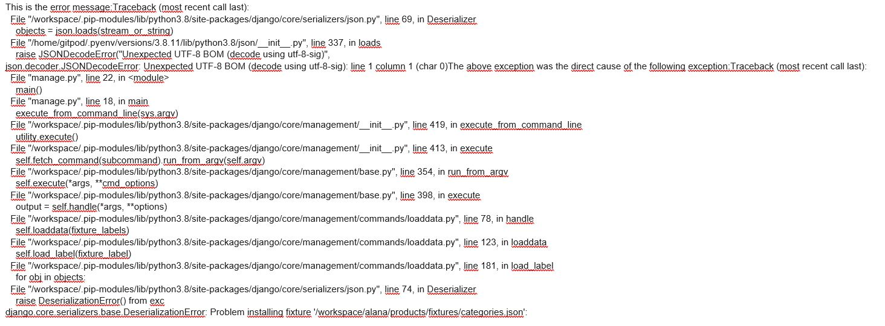


* Solution: I changed format from from computer while downloading the jason files from UTF-8 BOM to UTF-8. See the image below: 


From

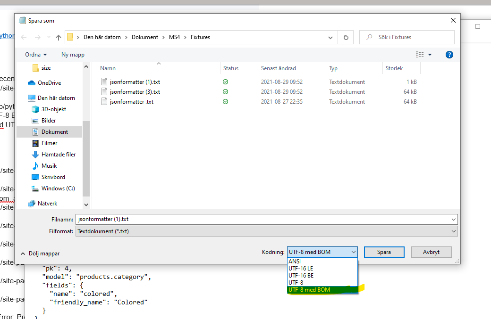


to  

  
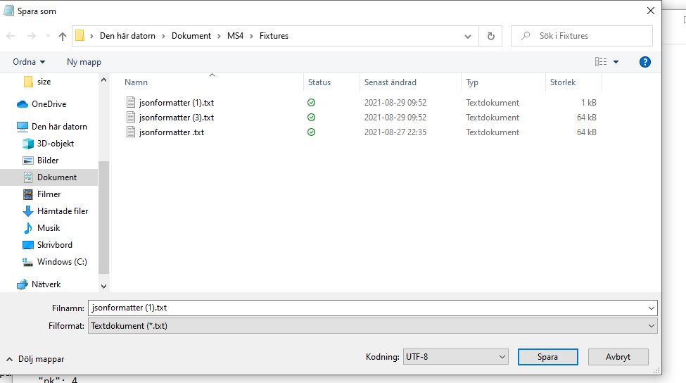


**Problem creating a stripe webhook endpoint**


  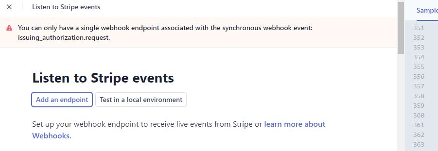


* Solution: I got help from stripe support to remove all events issuing form the event list. I was able to create a webhook endpoint after that.


**Problem deploying to heroku**

I tried to figured out what was wrong without success. I took contact with the tutorial and **Igor C** told me to have a look again after my secret key. The value of my secret was wrong.


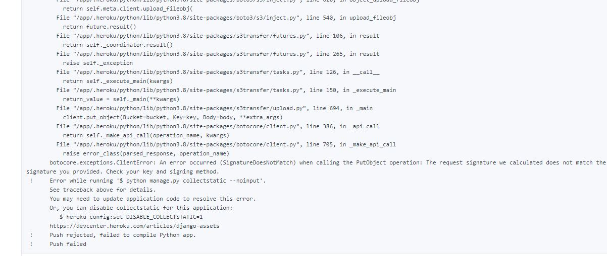


Solution from tutor support: 


[Back to Table of contents](#Table-of-Contents)
 ___

 ## Deployement 

* Alana-app is deployed successfully to heroku and AWS using gipod, with version control in Github. The media files were uploaded manually to AWS. I run with some issues during deployement but everything went well att the end. 

1. Github
 
 * Create a github repo repository from Code Institute template. It will be the name of your project.

 * Click the green'gitpod' 

 * First thing to do: 

   * Install django: pip3 install django

   * Connect your app to django: django-admin startproject XXXX.

   * create a file called 'runtime.txt'. It defines which version of python running on the server.

   * Install allauth byrunning the CLI command __pip3 install django-allauth==0.41.0


2. Deploy to [heroku](https://www.heroku.com/)


   * Create a free account at heroku.com

   * In the registration form , set your role to hobbyist and primary davelopment language as python

   * Install the [heroku CLI](https://devcenter.heroku.com/articles/heroku-cli) if you are not using Code Intsitute template

   * Log in gitpod and type: heroku login

   * Install these packages: 

      * pip3 install psicopg2

      * pip3 install gunicorn

  * Run pip3 freeze --local > requirements.txt

  - Create your app

 * Import value from settings.py to Heroku Config Vars

 * Disable Heroku from collecting static files by running: 

    DISABLE_COLLECSTATIC=1

* In settings.py, fill the ALLOWED_HOSTS APP with your herokuapp name

* Back to Heroku and click on deploy

* Connect to Github with your repository name

* Enabled automatis deployement from Heroku

* Push all code to Heroku by running *git push -u heroku main*

* Click deploy back to Heroku settings.

* Generate Django Secret_key using a key genartor and add this value to the Heroku config Vars


3. Install database

* pip3 install dj_database_url

* pip3 install psycopg2-binary

* Run pip3 freeze > requirements.txt

* Run python3 manage.py showmigrations --dry-run

* Run python3 manage.py showmigrations

* Run python3 manage.py migrate --plan

* Run python3 manage.py migrate

* Loaddata categories and products

* Pip3 install django-countries


  

4. Connecting to [AWS](https://aws.amazon.com/)


* AWS will store all your staticfiles.

* Create an account AWS.

* While your account is set up search for **S3**.

* Create a bucket, for best practice use the same name as your heroku app.

* Click the region near you.

* Configure the new bucket.

* Choose Properties and static hosting.

* update the CORS confirguration 

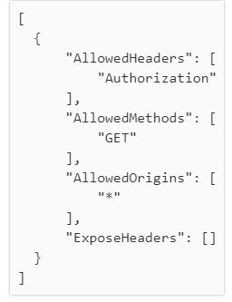


* Create a policy

* Select 'S3 bucket policy and mark allow all principals

* Create a new user to manage to the group.
  
* Create a folder and upload your media files

* Back to gipod: 

* pip3 install boto3

* Pip3 install django-storages

* pip3 freeze > requirements.txt

* Add storages under the allowed apps

* Make migrations


5. Webhook / Stripe

* Login to your stripe dashboard and copy your STRIPE_PUBLI_KEY and STRIPE_SECRET_KEY. 

* Go to developpers, click on webhook and create an endpoint using your herokuapp url.

* Select all events

* Your STRIPW_WH_KEY is hiding under your endpoint you just created.


[Back to Table of contents](#Table-of-Contents)
 ___

 ## Credits
 

 * Media: 

   * A great thank to [pixabay](https://pixabay.com/) for free dowwloading of my images

   * Description and name of my products were inspired by [jjshouse](https://www.jjshouse.se/) and [bhldn](https://www.bhldn.com/) .


* Code: 

  * A million thanks to Tim Nilson and Chris, Code institute tutors for the Boutique Ado project. I created my e-commerce based to the project Botique.

  * Thanks to [fontspace](https://www.fontspace.com) for the fonts I used on my website. 

  * Code snippet from [codepen](https://img.icons8.com/cute-clipart/100/000000/bug.png) for my error pages 403.404 and 500.

  * Code snippet from [The Book Store](https://github.com/EllyC20/The-BookStore-MS4) for the review custom model. 

  * Thanks to [Coding Stuff](https://www.youtube.com/watch?v=reFJ9hBLFUY&t=514s) for great tutorila about rating a product. 


* Support:

  * Great thanks to Igor C, Kevin, Sean, Joahnn and Fatima from Code Institute for helping me to solve my problem. 

  * Great thanks to [Anders Jansson](https://www.linkedin.com/in/maximoanders/) and my family for testing the functionality of my website. 


[Back to Table of contents](#Table-of-Contents)
 ___

[My Github page](https://github.com/Sojasmine/alana)


[My website](https://alana-app.herokuapp.com/)


September © 2021


